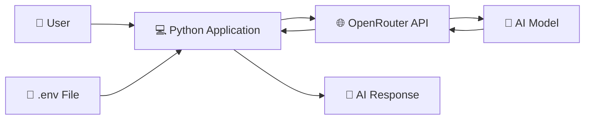

## AI Chatbox Project

This is a simple, command-line based AI chatbot application built using Python. 
It connects with the OpenRouter API to fetch smart and contextual responses based on user queries.

---
##  Project  Architecture

✨ Features
Real-time Interaction: Users can chat with the AI model directly via the terminal interface.
OpenRouter Integration: Uses OpenRouter API to easily access advanced language models.
Secure Environment: Environment variables (.env) are used to securely store the API keys.
Input Validation: Handles empty messages and provides a clean exit command (exit).

🚀 How to Run

Install Dependencies
Bash
pip install -r requirements.txt

Configure API Key
Open your .env file and add your key:
Plaintext
OPENROUTER_API_KEY=your_actual_api_key_here

Run the Chatbot
Bash
python chatbox.py